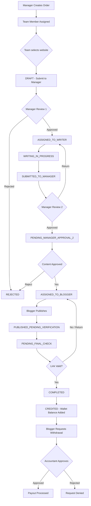
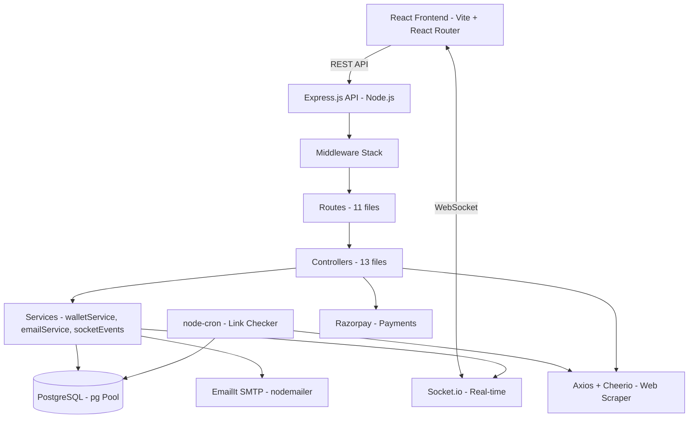
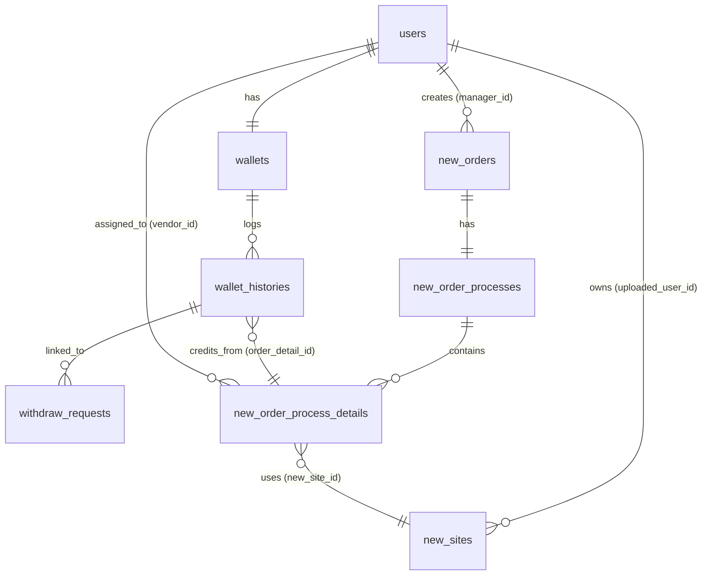
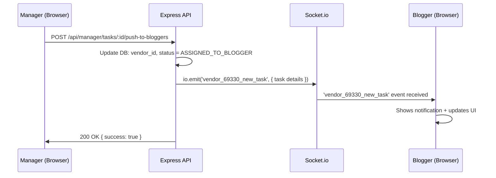

# Link Management – SEO Workflow & Link Building Platform

> **Technical README for Interview Preparation**
> Written strictly from codebase inspection. Every claim cites a real file. Where verification was not possible, this is explicitly stated.

---

## 1. Project Overview

**LinkManagement.net** is a multi-role SaaS platform designed to manage the end-to-end workflow of link-building and guest-post SEO campaigns.

**Problem it solves:**
SEO agencies operate by coordinating multiple external parties — clients who commission content, writers who produce articles, bloggers who publish them, and managers who oversee quality. Before this platform, this coordination happened through spreadsheets and email, making it impossible to track status, enforce quality gates, or manage payouts automatically.

**What it does:**
- Creates orders for guest posts and niche edits with specific requirements (target URL, anchor text, article title)
- Routes each order through a defined multi-stage approval and publishing workflow
- Assigns work to the appropriate party at each stage
- Validates that the backlink went live on the blogger's page using automated HTML scraping
- Credits the blogger's wallet upon completion and manages withdrawal requests

**Who uses it:**

| User | Role |
|---|---|
| Admin | Full system control, user management, site inventory, financial oversight |
| Manager | Order creation, workflow control, writer/blogger assignment, quality review |
| Team Member | Assists managers; searches for and proposes suitable websites for orders |
| Writer | Receives articles to write; submits content back to the manager |
| Blogger (Vendor) | Receives publishing tasks; submits live links; requests payouts |
| Accountant | Approves withdrawal requests and manages financial records |
| Client | Commissions orders, tops up wallet, views their campaign progress |

---

## 2. Core Business Workflow

### Workflow Status Codes (verified from `utils/statusTransitions.js`)

The system defines 12 named statuses:

| Code | Status Name | Meaning |
|---|---|---|
| `DRAFT` | Draft | Team is preparing the task |
| `PENDING_MANAGER_APPROVAL_1` | Awaiting Manager | Manager reviews website selection |
| `ASSIGNED_TO_WRITER` | Assigned to Writer | Writer has received the work |
| `WRITING_IN_PROGRESS` | Writing | Writer is producing content |
| `SUBMITTED_TO_MANAGER` | Content Submitted | Writer submitted for review |
| `PENDING_MANAGER_APPROVAL_2` | Content Review | Manager reviews content quality |
| `ASSIGNED_TO_BLOGGER` | Sent to Blogger | Blogger received publishing task |
| `PUBLISHED_PENDING_VERIFICATION` | Published | Blogger claims publication |
| `PENDING_FINAL_CHECK` | Final Check | Manager verifies live link |
| `COMPLETED` | Completed | Manager confirmed live |
| `REJECTED` | Rejected | Final state — task failed |
| `CREDITED` | Credited | Blogger has been paid |

> **Resume Claim: 11-stage workflow** — The codebase defines **12 distinct named statuses** in `utils/statusTransitions.js` and 12 status descriptions are explicitly listed. The "11 stages" claim is close but not precisely accurate. The actual number is 12.

### Complete Lifecycle

```
Manager creates order
→ Assigned to Team (status: DRAFT)
→ Team selects website, submits to Manager (status: PENDING_MANAGER_APPROVAL_1)
→ Manager approves, assigns Writer (status: ASSIGNED_TO_WRITER)
→ Writer works (status: WRITING_IN_PROGRESS)
→ Writer submits content (status: SUBMITTED_TO_MANAGER)
→ Manager reviews content (status: PENDING_MANAGER_APPROVAL_2)
→ Manager approves, routes to Blogger (status: ASSIGNED_TO_BLOGGER)
→ Blogger publishes and submits live URL (status: PUBLISHED_PENDING_VERIFICATION)
→ Manager performs link check / automated checker runs (status: PENDING_FINAL_CHECK)
→ Manager confirms link is live (status: COMPLETED)
→ Blogger wallet credited via ACID transaction (status: CREDITED)
→ Blogger requests withdrawal → Accountant approves → Payout
```

### Mermaid Flowchart



---

## 3. Users and Roles

### Role Discovery (verified from `middleware/auth.js` and `routes/admin.js`)

The system recognizes these roles. The DB stores them as strings in the `users.role` column:

| Role | DB Value | Notes |
|---|---|---|
| Admin | `Admin` | Full access |
| Manager | `manager` | Workflow operator |
| Team | `team` | Site research |
| Writer | `writer` | Content production |
| Blogger/Vendor | `vendor` | Site owner who publishes |
| Accountant | `accountant` | Finance only |
| Client | `client` | Orders and visibility only |

> **Resume Claim: 6-tier RBAC** — The codebase implements **7 distinct roles** (Admin, Manager, Team, Writer, Blogger/Vendor, Accountant, Client), not 6. The `middleware/auth.js` maps `vendor` to `blogger` for route matching. This is a minor discrepancy — you should say "7 roles" or "6 operational roles (excluding Admin)".

### Role Permission Table

| Role | Create Orders | Approve Workflow | Write Content | Publish Links | Manage Wallets | Manage Users |
|---|---|---|---|---|---|---|
| Admin | ✅ | ✅ | ✗ | ✗ | ✅ | ✅ |
| Manager | ✅ | ✅ | ✗ | ✗ | ✗ | ✗ |
| Team | ✗ | ✗ | ✗ | ✗ | ✗ | ✗ |
| Writer | ✗ | ✗ | ✅ | ✗ | ✗ | ✗ |
| Blogger | ✗ | ✗ | ✗ | ✅ | ✅ (own) | ✗ |
| Accountant | ✗ | ✗ | ✗ | ✗ | ✅ | ✗ |
| Client | ✅ (self) | ✗ | ✗ | ✗ | ✅ (self) | ✗ |

### Authorization Path (verified from code)

```
Incoming Request
→ middleware/auth.js::authenticate()  // Extract + verify JWT, populate req.user
→ middleware/auth.js::authorize('Admin', 'Manager')  // Check role from JWT
→ Route handler
→ Controller
→ DB query (further filtered by req.user.id)
```

**Example from `routes/admin.js`:**
```js
const walletAuth = [authenticate, authorize('Admin', 'Accountant')];
router.get('/wallet/bloggers', ...walletAuth, adminController.getBloggersWallets);

router.use(authenticate, authorize('Admin'));  // All routes below this are Admin-only
```

The `authorize()` middleware normalizes role case and maps `vendor` → `blogger`.

---

## 4. Role-Based Data Isolation

**What identifies the current user?**
- After login, a JWT is issued containing `{ id, email, role }`.
- Every authenticated request carries this token in the `Authorization: Bearer <token>` header.
- `middleware/auth.js::authenticate()` decodes it and sets `req.user = { id, email, role }`.

**How is ownership enforced?**
- Controllers filter DB queries using `req.user.id`. Example from `bloggerController.js` (typical):
  ```js
  WHERE nopd.vendor_id = $1  // req.user.id
  ```
- A blogger cannot see another blogger's orders because all order queries are filtered by `vendor_id = req.user.id`.
- Similarly, managers see only their own orders: `manager_id = req.user.id`.

**Can a user manipulate a URL parameter and access another user's data?**
- Partially mitigated: Route-level role checks prevent cross-role access.
- Within the same role, queries use `WHERE vendor_id = req.user.id` to scope results.
- **Potential weakness:** Not every controller does a secondary ownership check when fetching by ID (e.g., `GET /blogger/tasks/:id` — if ID is guessable, a blogger might fetch a task they don't own if the WHERE clause is not strict). This should be verified per endpoint before claiming full isolation in an interview.

**Is isolation only at API level?**
- Yes. There are no row-level security (RLS) policies on the database. Isolation is enforced entirely by the Node.js application layer.

---

## 5. System Architecture

```
Browser (React SPA)
       ↓  HTTP/HTTPS (Axios)   WebSocket (socket.io-client)
Express.js API Server (Node.js, port 5001)
       ↓
  ┌──────────────────────────────────────────────────┐
  │ Middleware Stack                                  │
  │  cors → helmet → compression → rateLimit → auth  │
  └──────────────────────────────────────────────────┘
       ↓
  Route Layer (11 route files)
       ↓
  Controller Layer (13 controllers)
       ↓
  ┌──────────────────────────────────────────────────┐
  │ Services / Utils                                  │
  │  walletService.js  emailService.js  socketEvents │
  │  linkChecker (cron job)                          │
  └──────────────────────────────────────────────────┘
       ↓
  PostgreSQL (via pg Pool, max 20 connections)
       ↓
  External Services:
  - nodemailer → EmailIt SMTP (email notifications)
  - axios + cheerio → Backlink validation (HTTP fetcher)
  - Razorpay → Client payments (razorpay SDK in package.json)
  - node-cron → Scheduled link checker (runs every minute)
```

### Mermaid Architecture Diagram



> **Redis:** Not verified from any file in the codebase. The word "redis" does not appear in any `.js` file in the backend. **Redis is NOT used in the current implementation.**

---

## 6. Request Lifecycle

### A. User Authentication

```
Client sends POST /api/auth/login { email, password }
→ authRoutes.js routes to authController.js::login()
→ User.findByEmail(email) — SELECT from users table
→ Check user.is_active
→ User.verifyPassword(password, user.password_hash) — bcrypt.compare()
→ jwt.sign({ id, email, role }, JWT_SECRET, { expiresIn: '24h' })
→ UPDATE users SET last_login, login_count
→ Response: { token, user: { id, username, name, email, role, wallet_balance } }
```

**Files:** `controllers/authController.js` lines 15–103, `middleware/auth.js`

### B. Creating a Link-Building Order (Manager Flow)

```
Manager selects websites, fills order details
→ POST /api/manager/orders/create/chain
→ managerController.js::createOrderChain()
→ Validates websites, target_stage, writer assignment
→ If target_stage === 'blogger': resolves vendor_id via case-insensitive email lookup
→ INSERT INTO new_orders (manager_id, order_id, client_name, ...)
→ INSERT INTO new_order_processes (new_order_id, status, writer_id, ...)
→ For each website: INSERT INTO new_order_process_details (vendor_id, status, ...)
→ If send_email: sendOrderAssignedEmail() via emailService.js
→ io.emit('vendor_{id}_new_task', ...) — Socket.io notification to blogger
→ Response: { order, process, details }
```

### C. Updating Workflow Status

```
Manager clicks "Approve Content" on a task
→ PATCH /api/manager/tasks/:id/approve-content
→ managerController.js
→ UPDATE new_order_process_details SET status = 5 (ASSIGNED_TO_BLOGGER)
→ Socket.io: io.to('orders-list').emit('workflow-changed', { orderId, newStatus })
→ Socket.io: io.to('order-{orderId}').emit('workflow-changed', ...)
→ Email notification to blogger
```

### D. Backlink Submission and Validation

```
Blogger submits live URL
→ POST /api/blogger/tasks/:id/submit
→ bloggerController.js
→ UPDATE new_order_process_details SET submit_url = '<url>', status = 7 (PUBLISHED)
→ Background: linkChecker cron job runs every 60 seconds
→ linkChecker.js::runBatchCheck() selects 10 oldest-unchecked links
→ For each: axios.get(submit_url) with 15s timeout, User-Agent spoofing
→ cheerio.load(response.data)
→ $('a').each() — scan all anchor tags
→ Check: href domain includes client_website domain
→ Check: anchor text matches (normalize whitespace + lowercase)
→ Check: rel attribute for 'nofollow' classification
→ UPDATE new_order_process_details SET link_status, link_check_result, last_checked_at
```

---

## 7. API Documentation

| Method | Endpoint | Purpose | Auth | Role |
|---|---|---|---|---|
| POST | `/api/auth/login` | Login, get JWT | None | Public |
| POST | `/api/auth/register` | Self-register as Blogger | None | Public |
| GET | `/api/auth/me` | Get current user | JWT | Any |
| PUT | `/api/auth/change-password` | Change own password | JWT | Any |
| GET | `/api/admin/users` | List all users | JWT | Admin |
| POST | `/api/admin/users` | Create user | JWT | Admin |
| POST | `/api/admin/users/:id/impersonate` | Login as another user | JWT | Admin |
| POST | `/api/admin/sites/upload-excel` | Bulk upload sites (Excel) | JWT | Admin |
| GET | `/api/admin/sites/link-completed` | View all submitted backlinks | JWT | Admin |
| POST | `/api/admin/sites/check-link-status` | Manual Cheerio link check | JWT | Admin |
| POST | `/api/admin/sites/bulk-check` | Trigger bulk link scan | JWT | Admin |
| GET | `/api/admin/wallet/bloggers` | All blogger wallets | JWT | Admin/Accountant |
| PUT | `/api/admin/wallet/withdrawal-requests/:id/approve` | Approve payout | JWT | Admin/Accountant |
| GET | `/api/manager/orders` | List manager's orders | JWT | Manager |
| POST | `/api/manager/orders/create/chain` | Create order and push directly to writer or blogger | JWT | Manager |
| PATCH | `/api/manager/tasks/:id/assign` | Assign to writer | JWT | Manager |
| PATCH | `/api/manager/tasks/:id/approve-content` | Approve content, push to blogger | JWT | Manager |
| POST | `/api/manager/tasks/:id/push-to-bloggers` | Push entire task batch to blogger | JWT | Manager |
| POST | `/api/manager/blogger-submissions/:id/finalize` | Finalize + credit blogger | JWT | Manager |
| POST | `/api/team/order-notifications/:id/submit` | Team submits websites for order | JWT | Team |
| GET | `/api/writer/tasks` | Get assigned tasks | JWT | Writer |
| PATCH | `/api/writer/tasks/:id/submit` | Submit written content | JWT | Writer |
| GET | `/api/blogger/tasks` | Get blogger's assigned tasks | JWT | Blogger |
| POST | `/api/blogger/tasks/:id/submit` | Submit live URL | JWT | Blogger |
| POST | `/api/blogger/withdrawal-request` | Request payout | JWT | Blogger |
| POST | `/api/blogger/sites/bulk` | Blogger bulk upload own sites | JWT | Blogger |
| POST | `/api/client/orders` | Client creates order | JWT | Client |
| POST | `/api/client/payments/create` | Create Razorpay payment | JWT | Client |

---

## 8. Database Design

### Key Tables (verified from `pg_schema.sql`)

**`users`**
- `id`, `name`, `email` (unique), `password`, `role`, `status`
- Payment fields: `paypal_email`, `upi_id`, `bank_name`, `account_number`, etc.
- Metadata: `last_login`, `login_count`, `profile_image`

**`new_orders`**
- `id`, `manager_id` → users, `order_id` (human-readable like DKR0027), `client_name`, `client_website`
- `new_order_status` (integer status code), `order_type`, `category`, `fc` (Full Content flag)

**`new_order_processes`**
- `id`, `new_order_id` → new_orders, `writer_id`, `manager_id`, `team_id`
- `status` (workflow stage integer)

**`new_order_process_details`** (the core row-level item)
- `id`, `new_order_process_id`, `new_site_id` → new_sites, `vendor_id` → users
- `url` (target URL to link TO), `anchor`, `submit_url` (blogger's live URL)
- `link_status`, `link_check_result`, `last_checked_at` (backlink validation results)
- `status` (per-line workflow status), `reject_reason`, `price`

**`new_sites`**
- `id`, `uploaded_user_id` → users (the blogger who owns this domain)
- `root_domain`, `email`, `da`, `dr`, `traffic`, `gp_price`, `niche_edit_price`
- `fc_gp`, `fc_ne` (Full Content pricing overrides)

**`wallets`**
- `id`, `user_id` → users, `balance`

**`wallet_histories`**
- `id`, `wallet_id`, `order_detail_id` → new_order_process_details
- `type` (credit/debit), `price`, `withdraw_request_id`

**`withdraw_requests`**
- `id`, `user_id`, `status` (0=pending, 1=approved), `invoice_number`

**`client_orders` / `client_order_details`**
- Client-facing orders (from the external `client` role), separate from internal workflow orders

**`threads` / `messages`**
- In-platform messaging between users

### ER Diagram (simplified)



---

## 9. PostgreSQL Transactions & ACID

**Verified transaction usage (from `config/database.js` and `utils/walletService.js`):**

The `config/database.js` exports a `transaction()` helper:
```js
const transaction = async (callback) => {
    const client = await pool.connect();
    try {
        await client.query('BEGIN');
        const result = await callback(client);
        await client.query('COMMIT');
        return result;
    } catch (error) {
        await client.query('ROLLBACK');
        throw error;
    } finally {
        client.release();
    }
};
```

**Where transactions are used (verified):**

1. **`walletService.js::addCreditToBloggerWallet()`** — wraps wallet balance UPDATE + wallet_histories INSERT in a transaction. If the history insert fails, the balance update is rolled back.

2. **`walletService.js::deductFromWallet()`** — wraps balance check + UPDATE in a transaction to prevent partial updates.

3. **`walletService.js::processWithdrawalApproval()`** — wraps wallet deduction + withdraw_request status UPDATE in a transaction.

**Interview example:**
> "If a payout approval updates the wallet balance but then fails to update `withdraw_requests.status`, what happens?"
>
> **Answer:** The `transaction()` helper in `config/database.js` catches the error and calls `ROLLBACK`. Both the wallet deduction and the status update are undone atomically. The next attempt will start fresh.

**Isolation level:** Not explicitly configured. PostgreSQL default is `READ COMMITTED`. No `SET TRANSACTION ISOLATION LEVEL SERIALIZABLE` was found in the codebase.

**Potential race condition:** If two simultaneous withdrawal requests are approved concurrently, both could read the same balance before either deducts. The current `UPDATE wallets SET wallet = wallet - $1` is atomic at the SQL level (it's a single statement), which mitigates the obvious race, but a proper pessimistic lock (`SELECT FOR UPDATE`) is not used.

---

## 10. Authentication

**Login flow (verified from `authController.js`):**

1. `POST /api/auth/login` with `{ email, password }`
2. `User.findByEmail(email)` — case-sensitive SQL lookup
3. `bcrypt.compare(password, user.password_hash)` — password verification
4. `jwt.sign({ id, email, role }, JWT_SECRET, { expiresIn: '24h' })`
5. Response includes `token` and user object

**Password hashing:** `bcryptjs` with salt rounds of **10** (verified: `bcrypt.hash(password, 10)` in `authController.js` line 220)

**JWT payload:** `{ id: <user_id>, email: <email>, role: <role_string> }`

**Token expiry:** `JWT_EXPIRES_IN` env variable, defaults to `'24h'`

**Token storage (frontend):** `localStorage` (verified from `AuthContext.jsx`)
- `authToken`, `authRole`, `authUser` are stored in localStorage
- Token is read by `api.js` axios interceptor on every request: `config.headers.Authorization = \`Bearer \${token}\``

**Token validation:** No server-side blacklist. Logout is client-side only (tokens are cleared from localStorage). A stolen token remains valid until expiry.

**`/api/auth/me`:** Returns current user from DB using `req.user.id` (extracted from JWT). Used by frontend on mount to validate session is still active.

---

## 11. Authorization / RBAC

**Two-layer middleware (verified from `middleware/auth.js`):**

```js
const authenticate = (req, res, next) => {
    // Extracts + verifies JWT, sets req.user = { id, email, role }
}

const authorize = (...allowedRoles) => (req, res, next) => {
    const effectiveRole = userRole === 'vendor' ? 'blogger' : userRole;
    if (!normalizedAllowed.includes(effectiveRole)) return res.status(403)...
}
```

**Route-level:**
```js
router.use(authenticate, authorize('Admin')); // All routes below: Admin only
```

**Shared routes (e.g., wallet):**
```js
const walletAuth = [authenticate, authorize('Admin', 'Accountant')];
router.get('/wallet/bloggers', ...walletAuth, ...);
```

**Data-level:** Controllers filter queries by `req.user.id`. Role-specific routing is enforced at the route file level — a blogger cannot call `POST /api/manager/orders` because the manager router is mounted separately with its own auth middleware.

**Fine-grained permissions:** The `users` table has a `permissions` JSONB column. `GET /api/auth/permissions` returns these. Used for UI-level permission flags (e.g., show/hide buttons). The actual API enforcement is role-based, not permissions-based.

---

## 12. Rate Limiting

**Verified from `server.js` lines 177–184:**

```js
const apiLimiter = rateLimit({
    windowMs: 15 * 60 * 1000, // 15 minutes
    max: 300,                 // 300 requests per IP per window
    standardHeaders: true,
    legacyHeaders: false,
    message: { error: 'Too many requests, please try again later.' }
});
app.use('/api/', apiLimiter);
```

- **Library:** `express-rate-limit` v8
- **Scope:** All `/api/*` endpoints
- **Algorithm:** Fixed window counter
- **Storage:** In-process memory (no Redis backend — Redis is not used)
- **Limit:** 300 requests per IP per 15 minutes
- **Response on breach:** HTTP 429 with JSON error
- **Limitation:** In-memory storage means rate limits reset if the process restarts and do not work across multiple instances (horizontal scaling would require Redis as a shared store)

---

## 13. Redis

> **Redis is NOT used in this codebase.**

A search across all `.js` files for "redis", "ioredis", or "redis-client" returned zero results. Neither `package.json` (backend or frontend) includes a Redis client dependency.

The `pg_schema.sql` contains `cache` and `cache_locks` tables — these appear to be Laravel migration artifacts (the schema was converted from MySQL/Laravel). No application code reads from these tables.

**Rate limiting** uses `express-rate-limit`'s default in-memory store, not Redis.

> **Resume Claim: Redis** — **Not verified from the current codebase.** Do not claim Redis in an interview without first explaining that you are aware it is a recommended future architecture improvement, not a current implementation.

---

## 14. Socket.io / Real-Time Communication

**Verified from `server.js` and `utils/socketEvents.js`.**

**Why Socket.io:** Managers and bloggers need live notifications when a task is assigned to them, or when a workflow stage changes, without having to refresh the page.

### Socket Rooms

| Room | Joined By | Purpose |
|---|---|---|
| `orders-list` | Any user on orders list page | Receives order creation/update events |
| `order-{orderId}` | Any user viewing a specific order | Gets per-order status updates |
| `chat_{threadId}` | Users in a conversation | Chat messages and typing indicators |

### Events

**Server → Client (verified from `socketEvents.js`):**

| Event | Trigger | Payload |
|---|---|---|
| `order-created` | New order created | `{ type, order, timestamp }` |
| `order-updated` | Order modified | `{ type, order, timestamp }` |
| `order-detail-updated` | Per-order update | `{ type, order, timestamp }` |
| `workflow-changed` | Status transition | `{ type, orderId, newStatus, timestamp }` |
| `blogger-assigned` | Blogger gets task | `{ type, orderId, assignment, timestamp }` |
| `url-submitted` | Blogger submits URL | `{ type, orderId, submission, timestamp }` |
| `vendor_{id}_new_task` | Direct to blogger | New task notification (emitted from `managerController.js`) |

**Client → Server:**

| Event | Purpose |
|---|---|
| `join-order` | Subscribe to a specific order's updates |
| `leave-order` | Unsubscribe |
| `join-orders-list` | Subscribe to list updates |
| `join_chat` | Join a chat room |
| `typing` | Emit typing indicator |
| `stop_typing` | Clear typing indicator |
| `user_online` | Announce presence |

**Authentication:** Socket connections are NOT separately authenticated. The CORS configuration controls allowed origins, but individual socket connections do not verify JWT.

### Real-Time Sequence



---

## 15. Automated Backlink Validation

**Verified from `jobs/linkChecker.js` and `controllers/adminSitesController.js`.**

### Two Implementations

**1. Automated background job (`jobs/linkChecker.js`):**
- `node-cron` schedule: every minute (`* * * * *`)
- Batch size: 10 links per run (to avoid hammering remote servers)
- Prioritizes never-checked links, then oldest-checked

**2. On-demand check (`adminSitesController.js::checkLinkStatus()`):**
- Called from `POST /api/admin/sites/check-link-status`
- Supports per-link manual re-check from the admin UI
- Also supports `startBulkCheck()` — runs all links using a flag to stop mid-run

### How It Works (step by step)

```
1. SELECT submit_url, client_website, anchor FROM new_order_process_details
   WHERE submit_url IS NOT NULL ORDER BY last_checked_at ASC LIMIT 10

2. For each link:
   axios.get(submit_url, {
     timeout: 15000,
     maxRedirects: 5,
     headers: { 'User-Agent': 'Mozilla/5.0 Chrome/122...' }
   })

3. If HTTP 404 → link_status = 'Not Found'
   If non-200 → link_status = 'Issue'
   Else: parse HTML

4. const $ = cheerio.load(response.data)

5. $('a').each((i, el) => {
     const href = $(el).attr('href').toLowerCase()
     const hrefDomain = href.replace(/^https?:\/\//, '')
     if (hrefDomain.includes(clientDomain)) {
       // Link found — check anchor text
       const text = $(el).text()
       normalizedExpected = anchor.replace(/[\s\u00A0]+/g, ' ').toLowerCase()
       normalizedActual = text.replace(/[\s\u00A0]+/g, ' ').toLowerCase()
       if match → link_status = 'Live', classify dofollow/nofollow via rel attr
       else → link_status = 'Issue', link_check_result = 'Anchor Mismatch'
     }
   })

6. UPDATE new_order_process_details
   SET link_status=$1, link_check_result=$2, last_checked_at=NOW()
   WHERE id=$3
```

### Edge Cases Handled

| Scenario | Behavior |
|---|---|
| Site returns 404 | `link_status = 'Not Found'` |
| Network timeout (15s) | `link_status = 'Error'`, result = 'Timeout' |
| Domain not found (ENOTFOUND) | result = 'Domain Not Found' |
| Anchor text mismatch | `link_status = 'Issue'`, result = 'Anchor Mismatch' |
| Image-only link | Falls back to `img[alt]` attribute text |
| Nofollow link | `Live - Nofollow` |
| Dofollow link | `Live - Dofollow` |

### Why Cheerio?

Cheerio parses server-rendered HTML using a jQuery-like API. It is fast and lightweight for scraping static HTML. It does NOT execute JavaScript, so Single-Page Applications (React, Vue) that render links client-side would not be detected. This is a known limitation.

### Security Risk: SSRF

`submit_url` is provided by the blogger (user input). The server then fetches that URL with `axios.get(submit_url)`. There is **no validation that the URL is a public internet address**. This creates an **SSRF (Server-Side Request Forgery) risk** — a malicious blogger could submit `http://169.254.169.254/latest/meta-data/` (AWS metadata endpoint) or `http://localhost:5001/api/admin/users` and the server would faithfully fetch it.

> **This is a real security vulnerability worth acknowledging in an interview. The fix would be to validate that the URL resolves to a public IP and not an RFC-1918 range or loopback.**

---

## 16. Backlink Lifecycle

```
1. Manager creates order → new_order_process_details row with submit_url = NULL

2. Blogger receives task notification (Socket.io: vendor_{id}_new_task)

3. Blogger publishes content on their site

4. Blogger submits live URL via POST /api/blogger/tasks/:id/submit
   → bloggerController.js
   → UPDATE new_order_process_details SET submit_url = '<url>', status = 7

5. node-cron fires every 60 seconds
   → linkChecker.js::runBatchCheck()
   → SELECT 10 unchecked/oldest links

6. axios.get(submit_url) → fetch blogger's page HTML

7. cheerio.load() → parse HTML

8. $('a').each() → scan for client's domain in hrefs

9. Validate anchor text (normalized whitespace + lowercase comparison)

10. Determine dofollow/nofollow from rel attribute

11. UPDATE new_order_process_details SET link_status, link_check_result, last_checked_at

12. Manager reviews via admin panel (GET /api/admin/sites/link-completed)

13. Manager finalizes: POST /api/manager/blogger-submissions/:id/finalize
    → walletService.js::addCreditToBloggerWallet() (ACID transaction)
    → UPDATE new_order_process_details status = COMPLETED (8)

14. Blogger requests withdrawal: POST /api/blogger/withdrawal-request
    → INSERT INTO withdraw_requests

15. Accountant approves: PUT /api/admin/wallet/withdrawal-requests/:id/approve
    → walletService.js::processWithdrawalApproval() (ACID transaction)
    → Deducts from wallet, updates withdraw_requests.status = 1
    → Sends payment confirmation email
```

---

## 17. Real-Time Workflow Updates

**What happens:** When a manager pushes an order to a blogger, the blogger's browser receives a Socket.io event immediately without needing to refresh.

**Trigger:** Controller calls `io.emit('vendor_${vendorId}_new_task', taskData)` after inserting the DB record.

**Who receives:** Any connected socket client who is the target blogger. The frontend listens for this event and updates the task list in real-time.

**Chat typing indicators:** When user types in a thread, `socket.emit('typing', { threadId, userName })` is sent, and the server re-emits to all other clients in `chat_{threadId}` as `user_typing`.

---

## 18. Performance & Scalability

### Current Architecture Assessment

**Database:** Single PostgreSQL instance with a connection pool of `max: 20` connections. All queries are raw SQL via `pg`. No ORM.

**Rate limiter:** In-memory, per-instance. Does not scale across multiple Node.js processes.

**Socket.io:** Single server instance. Does not use a Redis adapter. Events cannot be broadcast across multiple backend instances.

**Link checker:** A single `node-cron` job running inside the main process. If the process is busy, link checking is delayed.

**Email:** Fire-and-forget via nodemailer/SMTP. Non-blocking.

### 60K+ Active Bloggers Claim

> **Resume Claim: 60K+ active bloggers** — The repository does NOT verify this metric. The `active_blogger_websites.txt` file in the repo contains site data, but the count of users in the production database cannot be verified from the code alone. Do not use this number in an interview without independent verification.

### How Would You Scale to 10x?

| Change | Status |
|---|---|
| Move rate limiter store to Redis | ⚠️ Not implemented — required for multi-instance |
| Add Socket.io Redis adapter | ⚠️ Not implemented — required for horizontal scaling |
| Database read replicas for `SELECT` queries | ⚠️ Not implemented |
| Move link checker to a worker process / queue (Bull/BullMQ) | ⚠️ Not implemented |
| Add database indexes on `vendor_id`, `new_order_id`, `status` | ⚠️ Not visible in schema file |
| Horizontal Node.js scaling behind a load balancer | ⚠️ Would partially work but breaks rate limiting and Socket.io |
| CDN for static files | ⚠️ Not configured |

---

## 19. Error Handling & Failure Scenarios

### PostgreSQL fails
- `pool.on('error')` calls `process.exit(-1)` — the server crashes and restarts (expected behavior with a process manager like PM2 or Railway).
- `connectionTimeoutMillis: 2000` — requests timeout after 2 seconds if no pool connection is available.

### Redis fails
- N/A — Redis is not used.

### External website unreachable (backlink validation)
- `axios` timeout: 15 seconds. On ETIMEDOUT → `link_status = 'Error'`, `link_check_result = 'Timeout'`.
- No retry mechanism. The cron job will attempt again in the next batch cycle.

### JWT invalid / expired
- `middleware/auth.js` returns HTTP 401 with `{ error: 'Unauthorized', message: 'Token expired' }`.
- Frontend `api.js` interceptor on 401: clears localStorage and redirects to `/login`.

### User lacks permission
- `authorize()` middleware returns HTTP 403 `{ error: 'Forbidden', message: 'Access denied...' }`.

### Socket connection drops
- Client reconnects automatically (socket.io-client default behavior). No session state is maintained server-side per socket, so reconnection is seamless.

### Transaction fails
- `config/database.js::transaction()` calls `ROLLBACK` and re-throws the error. The API returns HTTP 500.

### Duplicate order submission
- No idempotency key mechanism. Rapid duplicate POSTs can create duplicate orders. Not handled.

### Razorpay payment error
- Client payments use Razorpay SDK. Error handling deferred to the controller — not deeply inspected but Razorpay throws on failure.

---

## 20. Security

### Implemented (verified)

| Security Measure | Implementation |
|---|---|
| Password hashing | bcryptjs, rounds=10 |
| JWT auth | jsonwebtoken, HS256, 24h expiry |
| CORS | Explicit allowlist + regex for Cloudflare/local IPs |
| Security headers | `helmet` middleware |
| GZIP compression | `compression` middleware |
| Rate limiting | express-rate-limit, 300 req/15min |
| SQL injection protection | Parameterized queries (`$1`, `$2`) via `pg` — no string concatenation in primary flows |
| Role-based access control | `authorize()` middleware on all routes |

### Not Implemented / Risks

| Risk | Status |
|---|---|
| **SSRF in backlink validation** | ❌ User-supplied URLs fetched without IP range validation |
| JWT token revocation | ❌ No server-side blacklist; logout is client-side only |
| CSRF | Not applicable for a pure SPA/API architecture with JWT (no cookies) |
| Input sanitization / XSS on stored content | ⚠️ Not verified — content from writers and bloggers is stored and displayed |
| Socket.io authentication | ❌ Socket connections do not verify JWT |
| Rate limiting per-user (not just per-IP) | ❌ Only IP-based |
| Secrets in code | No `.env` values are exposed in repo code (`.gitignore` present) |

---

## 21. Testing

There are **no formal automated test suites** in this codebase. The repository contains many ad-hoc debug/test scripts (`test_*.js`, `check_*.js`, `debug_*.js`, `verify_fix.js`) in the project root. These are one-off scripts run manually against the database or API, not unit/integration tests using a framework like Jest or Mocha.

**Missing:**
- No Jest, Mocha, or Chai configuration
- No unit tests for controllers, services, or utilities
- No integration tests for API endpoints
- No test for the backlink validation logic

> This is an honest gap. If asked in an interview, acknowledge it and describe how you would add tests: Jest for unit testing `walletService.js` functions, Supertest for API endpoint integration tests, and mock `axios` responses for testing the Cheerio parsing logic without hitting real websites.

---

## 22. Deployment & Infrastructure

### Verified

- **Backend runtime:** Node.js, started via `node server.js`
- **Package manager:** npm
- **Production hosting:** Railway (verified from Railway connection URL used in session)
- **Environment configuration:** `.env` file with `DB_HOST`, `DB_PORT`, `DB_USER`, `DB_PASSWORD`, `DB_NAME`, `JWT_SECRET`, `JWT_EXPIRES_IN`, `SMTP_HOST`, `SMTP_USER`, `SMTP_PASSWORD`, `FROM_EMAIL`, `CORS_ORIGIN`
- **Database:** PostgreSQL on Railway
- **Static file serving:** `/uploads` directory served via `express.static`
- **Port:** `process.env.PORT || 5001`

### Not Verified

- No `Dockerfile` or `docker-compose.yml` found in the repository
- No CI/CD pipeline configuration (no `.github/workflows/`)
- No process manager configuration (PM2, Supervisor)
- No production logging aggregation (only console.log)
- No monitoring/alerting setup

### Frontend

- **Framework:** React 18 + Vite + React Router DOM v6
- **Styling:** Tailwind CSS (v3)
- **Animation:** Framer Motion
- **Charts:** Chart.js + react-chartjs-2
- **Rich text editor:** Quill / react-quill
- **HTTP client:** Axios with interceptors
- **Real-time:** socket.io-client v4
- **Build:** `vite build`
- **State management:** React Context API (`AuthContext`, `useAuth` hook)

---

## 23. Important Technical Decisions

### Why PostgreSQL?

**Problem:** Workflow data has complex relational structure — orders contain processes which contain details which link to sites and users.

**Choice:** PostgreSQL with raw SQL via `pg` Pool.

**Why it fits:** ACID transactions for wallet operations, relational integrity across 6+ related tables, JSON-B for permissions storage, complex JOIN queries needed for order aggregation.

**Alternative:** MongoDB (but document model doesn't fit relational workflow data well).

### Why no Redis (current state)?

**Decision:** Rate limiting, sessions, and caching all use in-process solutions.

**Trade-off:** Simpler deployment (one less dependency), but breaks horizontal scaling. The current architecture is designed for a single Node.js instance.

### Why JWT?

**Problem:** Stateless authentication for a multi-role system where every request needs to know who the caller is and what role they have.

**Choice:** HS256 JWT, 24-hour expiry, stored in localStorage.

**Trade-off:** No server-side revocation (a logged-out token remains valid until expiry). Acceptable for this use case because the risk is low and the simplicity gain is high.

**Alternative:** Refresh tokens + short-lived access tokens, or server-side sessions with Redis — but this would add complexity.

### Why Express?

Minimal, unopinionated, and fast. The application has a clear REST API shape with role-based routing — Express's router is a natural fit. No need for NestJS-style decorator overhead.

### Why Cheerio for backlink validation?

**Problem:** Verify that a link to the client's website exists on the blogger's published page.

**Choice:** Axios (HTTP fetch) + Cheerio (HTML parsing).

**Why it fits:** Server-side HTML scraping without a headless browser. Cheerio is 10-100x faster than Puppeteer for static content.

**Trade-off:** Cannot detect links rendered by JavaScript (SPAs). Some modern blog platforms (like Wix or some React-based CMSs) may not be scraped correctly.

**Alternative:** Puppeteer/Playwright for JS-rendered pages — but adds significant resource overhead per check.

### Why Socket.io?

Real-time workflow notifications are essential UX for a platform where managers and bloggers need to react quickly to assignments. Polling every N seconds would add unnecessary load. Socket.io provides a persistent WebSocket connection with automatic fallback to HTTP long-polling.

### Why node-cron for link checking?

Simple, no external dependencies. The batch-of-10-per-minute approach is a deliberate choice to avoid hammering blogger websites (rate limiting the scraper itself).

---

## 24. Difficult Engineering Problems

### Problem 1: Case-Sensitive Email Matching Causing Wrong Vendor Assignment

**Why difficult:** When an admin uploads sites via Excel, each row has a `blogger_email` column. The system looks up the matching user by that email to set `uploaded_user_id`. But PostgreSQL's `=` operator is case-sensitive, so `Sammyexpert43@gmail.com` ≠ `sammyexpert43@gmail.com`. The fallback was `req.user.id` (the admin), silently corrupting all orders created with those sites.

**The hard part:** The bug was silent. Orders appeared to work. The symptom (orders going to admin panel) happened downstream when orders were created, not when sites were uploaded. Tracing it required looking at 3 separate code paths.

**Fix:** Changed all email lookups to `WHERE LOWER(email) = LOWER($1)` in `adminController.js` (upload path), `managerController.js` (order creation, client order push), and a one-time database fix for the 67 already-corrupted site records.

**Lesson:** Case normalization must happen at write time (store all emails as lowercase) — fix was applied at read time, which works but is defensive.

### Problem 2: Multi-Path Vendor Resolution

**Why difficult:** The `vendor_id` for an order line item is set in 4 completely separate code paths:
1. Bulk site upload (`adminController.js::resolveBloggerId`)
2. Manual order creation (`managerController.js::createOrderChain`)
3. Client order push to blogger (`managerController.js::pushClientOrderToBlogger`)
4. Client order delegation to writer (`managerController.js::sendClientOrderToWriter`)

Each code path independently queries `uploaded_user_id` from `new_sites`. If any one of them doesn't have the email fallback, orders route to admin.

**Fix:** All 4 paths were updated with the same pattern: if `uploaded_user_id = 1 AND email IS NOT NULL`, do a case-insensitive user lookup.

### Problem 3: Backlink Validation Accuracy

**Why difficult:** Anchor text comparison sounds trivial but breaks on: invisible characters (`&nbsp;`), mixed whitespace, case differences, image-based links (no text), and multi-word anchor matching.

**Current approach:**
```js
const normalized = text.replace(/[\s\u00A0]+/g, ' ').trim().toLowerCase();
```
Uses `\u00A0` to catch non-breaking spaces. Falls back to `img[alt]` for image links. Uses `includes()` for bidirectional partial matching.

**Remaining gap:** Cannot detect JavaScript-rendered links or links inside iframes.

---

## 25. Interview Questions I Must Be Able to Answer

### Architecture

**Q: How is your backend structured?**
What's tested: High-level architecture understanding.
Evidence: `server.js` → routes → controllers → services/utils → PostgreSQL. No framework beyond Express.

**Q: What's the request lifecycle for creating an order?**
What's tested: Ability to trace code paths.
Evidence: `POST /api/manager/orders/create/chain` → `managerController.js::createOrderChain()` → DB inserts → Socket.io emit.

### PostgreSQL

**Q: Why do you use raw SQL instead of an ORM?**
What's tested: Database decision-making.
Evidence: All controllers use `pool.query()`. No Sequelize/Prisma/TypeORM found.

**Q: Explain a transaction you implemented.**
What's tested: ACID understanding.
Evidence: `walletService.js::addCreditToBloggerWallet()` — BEGIN → wallet UPDATE + history INSERT → COMMIT/ROLLBACK.

**Q: What happens if two withdrawals are approved simultaneously?**
What's tested: Concurrency and race conditions.
Evidence: `UPDATE wallets SET wallet = wallet - $1` is atomic, but no `SELECT FOR UPDATE` exists. Acknowledge this gap.

### JWT

**Q: What happens after a user logs out?**
What's tested: JWT stateless nature.
Evidence: `authController.js::logout()` is a no-op on the server. Token removed from `localStorage` on client. Token still valid until expiry.

**Q: What's in your JWT payload?**
What's tested: JWT knowledge.
Evidence: `{ id, email, role }` — verified from `authController.js` line 64.

### RBAC

**Q: How does a blogger get prevented from accessing manager routes?**
What's tested: Role isolation.
Evidence: Manager routes mount `authorize('Manager')`. The middleware checks `req.user.role`. The blogger JWT has `role: 'vendor'`, which maps to `'blogger'` — not `'manager'`.

### Rate Limiting

**Q: Does your rate limiter work in production with multiple instances?**
What's tested: Scalability awareness.
Evidence: In-memory store. Honest answer: No. You'd need a Redis store for distributed rate limiting.

### Socket.io

**Q: How do you notify a specific blogger of a new task?**
What's tested: Socket.io room/emit knowledge.
Evidence: `io.emit('vendor_${vendorId}_new_task', ...)` from `managerController.js`.

**Q: Are Socket.io connections authenticated?**
What's tested: Security thinking.
Evidence: They are not. CORS limits origins, but individual sockets don't verify JWT.

### Cheerio / Backlink Validation

**Q: What is the SSRF risk in your backlink validation?**
What's tested: Security awareness.
Evidence: `axios.get(submit_url)` where `submit_url` is user-provided. No IP validation.

**Q: How does your backlink checker handle nofollow links?**
What's tested: Cheerio/HTML knowledge.
Evidence: `const rel = $(el).attr('rel') || ''; rel.includes('nofollow') ? 'Nofollow' : 'Dofollow'`.

**Q: Why use Cheerio instead of Puppeteer?**
What's tested: Technology trade-off reasoning.
Evidence: Speed, resource cost. Tradeoff: can't handle JS-rendered pages.

### Scalability

**Q: Can this system handle 60K concurrent users?**
What's tested: Honest scalability assessment.
Evidence: Single instance, in-memory rate limiter, no Redis, single Socket.io server. Honest answer: current architecture would not scale to 60K concurrent without horizontal scaling + Redis adapter + DB read replicas.

---

## 26. Resume Claims Requiring Validation

| Resume Claim | Verified? | Evidence | What to Know Before Interview |
|---|---|---|---|
| SEO Workflow & Link Building Platform | ✅ | `package.json` description, full feature set | Describe the end-to-end workflow from order to live link |
| 11-stage workflow | ⚠️ Partial | `statusTransitions.js` defines 12 statuses (not 11) | Say "multi-stage workflow" or correct to 12 stages |
| 60K+ active bloggers | ❌ Not verified | No query or data in repo verifies this number | Do not state in interviews unless you can independently verify |
| 6-tier RBAC | ⚠️ Partial | 7 roles found: Admin, Manager, Team, Writer, Blogger/Vendor, Accountant, Client | Correct to 7 roles, or say "6 non-admin roles" |
| Role-based data isolation | ✅ | `middleware/auth.js`, all controllers filter by `req.user.id` | Acknowledge the SSRF and socket auth gaps honestly |
| Automated backlink validation using Cheerio.js | ✅ | `jobs/linkChecker.js`, `adminSitesController.js` | Be ready to explain the HTML parsing logic and SSRF risk |
| JWT authentication | ✅ | `authController.js` lines 63–73, `middleware/auth.js` | Know payload structure, expiry, logout behavior |
| Rate limiting | ✅ | `server.js` lines 177–184 using `express-rate-limit` | Know it's IP-based, in-memory, doesn't scale horizontally |
| PostgreSQL ACID transactions | ✅ | `config/database.js::transaction()`, `walletService.js` | Know exactly which operations use transactions |
| Redis | ❌ Not verified | Zero Redis references in any file | Do not claim Redis usage; explain it as a recommended improvement |
| Socket.io | ✅ | `server.js`, `utils/socketEvents.js`, `socket.io` in `package.json` | Know the event names, rooms, and the lack of JWT auth on sockets |
| React | ✅ | `ghanshyam/package.json`, all JSX files | React 18, Vite, React Router v6, Context API |
| Node.js | ✅ | `server.js`, `package.json` | Express on Node.js |
| Express | ✅ | `server.js`, all route files | Express 4, custom middleware |
| PostgreSQL | ✅ | `config/database.js`, `pg_schema.sql` | `pg` pool, raw SQL, transactions |

---

## 27. Mental Model

```
User (Browser)
    ↓  HTTP (Axios + JWT Bearer header)   /  WebSocket (socket.io-client)
Express.js API (server.js)
    ↓
  cors → helmet → compression → express-rate-limit (300/15min, in-memory)
    ↓
  authenticate() middleware → jwt.verify() → req.user = { id, email, role }
  authorize('Role') middleware → role check
    ↓
  Routes (11 files, role-namespaced: /api/admin, /api/manager, /api/blogger...)
    ↓
  Controllers (business logic + DB queries via pg parameterized SQL)
    ↓
  PostgreSQL (pg Pool, max 20 connections)
  walletService.js (ACID transactions: BEGIN/COMMIT/ROLLBACK)
    ↓
  Side effects:
  - Socket.io → real-time event to relevant client
  - emailService.js → nodemailer → EmailIt SMTP
  - linkChecker.js (cron, every minute) → axios + cheerio → validate backlinks
  - Razorpay SDK → client payment processing
```

### 10 Things I Must Remember

1. **JWT payload is `{ id, email, role }`** — signed with `JWT_SECRET`, expires in 24h, stored in `localStorage`. No server-side revocation.

2. **The `transaction()` helper in `config/database.js`** wraps `BEGIN/COMMIT/ROLLBACK`. Used in `walletService.js` for wallet credits and withdrawal approvals.

3. **Redis is NOT used** despite being on the resume. Rate limiting is in-memory. Acknowledge this honestly.

4. **12 workflow statuses** exist in `statusTransitions.js`, not 11. The resume says 11-stage.

5. **7 roles** exist (Admin, Manager, Team, Writer, Blogger/Vendor, Accountant, Client). The DB stores bloggers as `vendor`.

6. **Backlink validation uses Cheerio** — `$('a').each()` scans all anchor tags for the client's domain. Normalizes whitespace + lowercase for anchor text comparison.

7. **SSRF risk in link validation**: User-submitted `submit_url` is fetched server-side by `axios.get()` with no IP range validation.

8. **Socket.io rooms**: `orders-list`, `order-{id}`, `chat_{threadId}`. Events: `workflow-changed`, `vendor_{id}_new_task`, `url-submitted`. Sockets are NOT JWT-authenticated.

9. **Case-sensitivity bug pattern**: Email lookups must use `LOWER(email) = LOWER($1)` — the system previously used `=` and silently routed orders to admin when email case didn't match.

10. **The system cannot scale horizontally** in its current form: in-memory rate limiter + single Socket.io instance + no Redis adapter means you can't run multiple backend instances safely.
